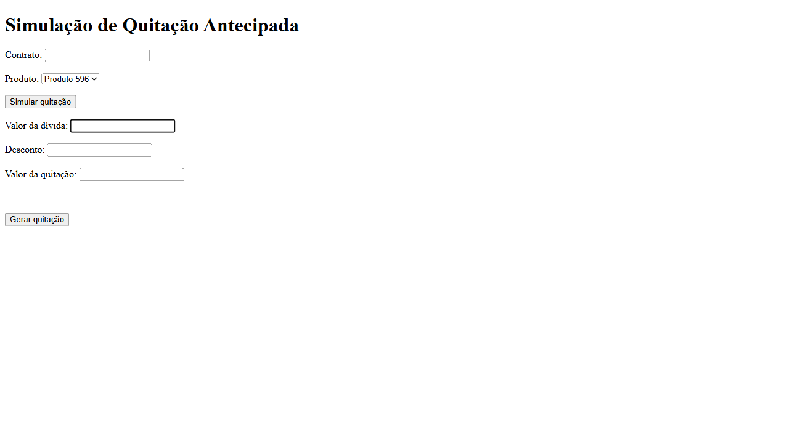

# QA Automation Framework

Framework de automação desenvolvido em **Java 21**, com **Playwright**, **JUnit 5** e **AssertJ**, voltado para testes Web, integração SOAP, leitura de XML e organização de testes em camadas.


## Objetivo

O projeto demonstra a construção de um framework de automação com foco em:

- separação de responsabilidades;
- reutilização de código;
- testes Web com Page Object Model;
- integração com serviços SOAP;
- conversão de respostas XML em objetos Java;
- preparação para validações em banco de dados;
- geração automática de evidências.

## Tecnologias

- Java 21
- Maven
- Playwright
- JUnit 5
- AssertJ
- SOAP Web Services
- XML DOM Parser
- JDBC
- Git e GitHub
- PowerShell

## Arquitetura

```text
Tests
  │
  ▼
Flow
  │
  ├──────────────► Pages ─► Playwright
  │
  └──────────────► Services
                       │
                       ▼
                  SOAP Client
                       │
                       ▼
                     Parser
                       │
                       ▼
                    Response

Repository
  │
  ▼
DatabaseExecutor
  │
  ▼
JDBC
```

### Responsabilidade das camadas

| Camada | Responsabilidade |
|---|---|
| `flow` | Coordena fluxos de negócio |
| `pages` | Interage com a interface Web |
| `locators` | Centraliza seletores |
| `service` | Coordena chamadas de serviços |
| `client` | Executa requisições SOAP |
| `builder` | Monta requests XML |
| `parser` | Converte XML em objetos Java |
| `response` | Representa respostas dos serviços |
| `repository` | Centraliza consultas SQL |
| `database` | Gerencia conexão e execução JDBC |
| `validator` | Concentra validações de negócio |

## Estrutura do projeto

```text
automacao-quitacao
├── evidencias
├── scripts
│   ├── create-class.ps1
│   ├── create-test.ps1
│   └── framework.ps1
├── src
│   ├── main
│   │   ├── java/com/automation
│   │   │   ├── builder
│   │   │   ├── client
│   │   │   ├── config
│   │   │   ├── database
│   │   │   ├── factory
│   │   │   ├── flow
│   │   │   ├── locators
│   │   │   ├── model
│   │   │   ├── pages
│   │   │   ├── parser
│   │   │   ├── repository
│   │   │   ├── request
│   │   │   ├── response
│   │   │   ├── service
│   │   │   ├── utils
│   │   │   └── validator
│   │   └── resources
│   └── test
│       ├── java/com/automation
│       └── resources
├── pom.xml
└── README.md
```

## Cenários implementados

- abertura do navegador com Playwright;
- simulação de quitação em aplicação HTML local;
- preenchimento de conta e valor;
- validação da mensagem de sucesso;
- captura automática de screenshot;
- montagem de request SOAP;
- validação da substituição de parâmetros no XML;
- parser de resposta SOAP;
- tratamento de SOAP Fault;
- validação de status HTTP;
- teste da Service com cliente SOAP controlado;
- validações de boleto com AssertJ.

## Execução

### Executar toda a suíte

```powershell
mvn clean test
```

### Executar somente o teste Web

```powershell
mvn "-Dtest=QuitacaoWebTest" test
```

### Executar somente o parser SOAP

```powershell
mvn "-Dtest=SoapResponseParserTest" test
```

### Executar somente a Service

```powershell
mvn "-Dtest=SimularQuitacaoServiceTest" test
```

## Configuração do navegador

Exemplo de configuração:

```properties
browser=chrome
headless=false
viewport.width=1920
viewport.height=1080
```

Para executar sem abrir a janela do navegador:

```properties
headless=true
```

## Geradores PowerShell

Criar uma classe:

```powershell
.\scripts\create-class.ps1 response MinhaResponse
```

Criar um teste:

```powershell
.\scripts\create-test.ps1 service MinhaServiceTest
```

Usar o gerador principal:

```powershell
.\scripts\framework.ps1 page LoginPage
```

Os scripts validam o caminho, criam o package correto e evitam sobrescrever arquivos existentes.

## Evidências

### Fluxo de quitação


### Login com sucesso



## Próximas evoluções

- relatório Allure completo;
- pipeline com GitHub Actions;
- integração real com banco de dados;
- testes de API REST com Rest Assured;
- Jackson para JSON e XML;
- execução paralela;
- parametrização com arquivos CSV e Excel;
- Docker.

## Autora

**Vanessa Lima**

QA Automation em formação, com foco em Java, Playwright, Selenium, testes de API, SOAP, SQL e arquitetura de frameworks de automação.